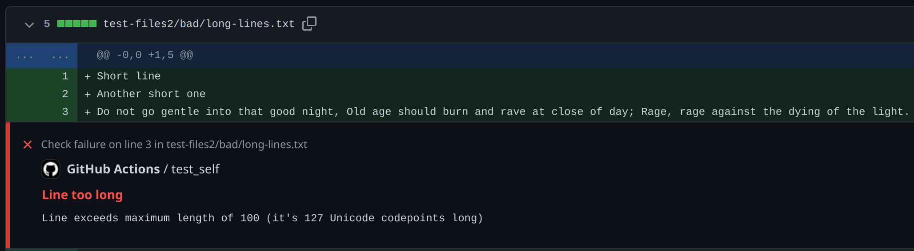

# GitHub Action to check basic file properties

Small action to make sure all files satisfy very basic properties:

- UTF-8 encoded
- `\n` line endings
- Single trailing newline
- Lines have no trailing whitespace
- Lines are shorter than a limit (default: 100)
- No tab characters `\t` used

The UTF-8 and `\n` line-endings checks are mandatory and cannot be disabled.
Everything else can be disabled/configured.

This action supports Markdown summaries and annotations:



**Note**:
This is an action tailored to my needs and I specifically developed this for use in my own projects.
If this is useful to you: great!
But I likely won't accept PRs with features that are not useful to me personally.

## Example

```yaml
name: Check basic style
on: [push, pull_request]
jobs:
  check:
    runs-on: ubuntu-latest
    steps:
    - uses: actions/checkout@v3
    - uses: LukasKalbertodt/check-basic-style@v0.1
```

You can configure this action via inputs.
See [`action.yml`](./action.yml) for information on all inputs.

```yaml
# ...
    - uses: LukasKalbertodt/check-basic-style@v0.1
      with:
        files: |
          *
          src/**
          dist/README.md
        max_line_len: 80
```
